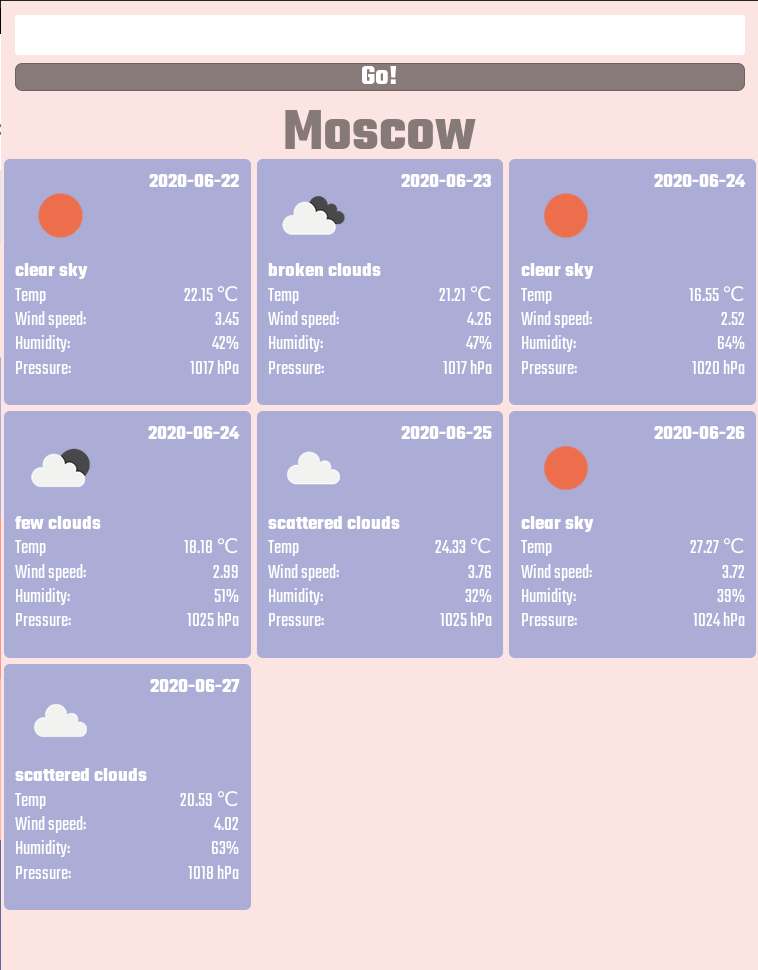
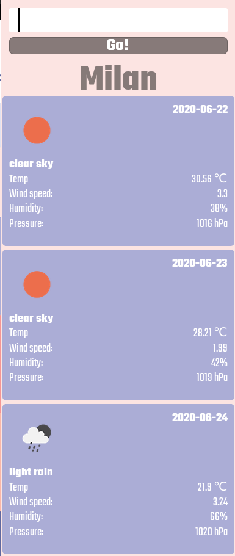

# weather2 - 
## Just does what it says: shows the weather

a JQuery + CSS grids version of the same app. Adaptive modern design, fast and user friendly.
Simply does what it shall, shows weather all around the world.\

Features:
- User location detection if permitted by user (conveniently finds out the weather at your location).
- Submit by hitting "enter" in hte search bar or by clicking "Go!" button
- Adpative (desktop/tablet/mobile) design keeps up with your devices

             

